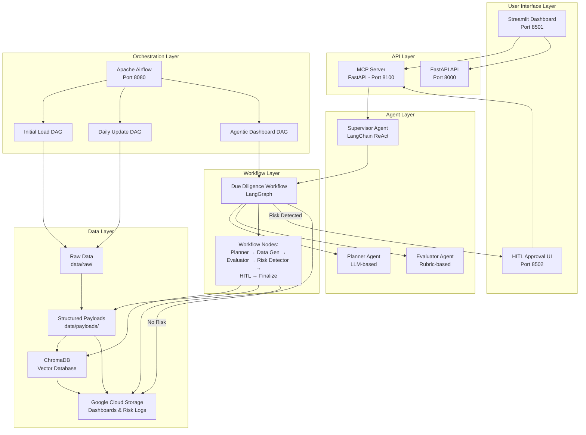
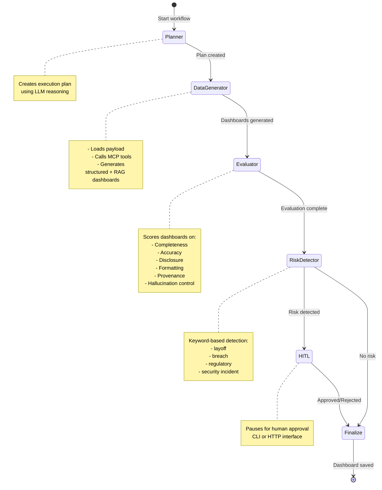

# System Architecture

## Project ORBIT - Agentic PE Intelligence Platform

**Version:** 2.0.0  
**Last Updated:** 2025-01-XX

---

## Table of Contents

1. [Overview](#overview)
2. [Architecture Diagram](#architecture-diagram)
3. [Component Details](#component-details)
4. [Data Flow](#data-flow)
5. [Workflow Graph](#workflow-graph)
6. [Technology Stack](#technology-stack)
7. [Deployment Architecture](#deployment-architecture)
8. [Security Architecture](#security-architecture)

---

## Overview

Project ORBIT is an **agentic, production-ready platform** for generating Private Equity due diligence dashboards for Forbes AI 50 companies. The system combines:

- **Structured Data Extraction** - Pydantic-validated company payloads
- **RAG Pipeline** - ChromaDB vector search with semantic retrieval
- **AI Synthesis** - GPT-4o powered dashboard generation
- **MCP Protocol** - Model Context Protocol for secure tool access
- **ReAct Agents** - LangChain-based supervisor agents with reasoning
- **Workflow Orchestration** - LangGraph-based conditional workflows
- **HITL Integration** - Human-in-the-Loop approval for risk verification
- **Cloud Storage** - Google Cloud Storage integration
- **Airflow Orchestration** - Automated daily/weekly data pipelines

---

## Architecture Diagram



---

## Component Details

### 1. MCP Server (FastAPI)

**Location:** `src/server/mcp_server.py`  
**Port:** 8100  
**Purpose:** Model Context Protocol server exposing tools, resources, and prompts

**Endpoints:**
- **Tools:** 4 endpoints (structured, RAG, unified, risk)
- **Resources:** 1 endpoint (company list)
- **Prompts:** 1 endpoint (dashboard template)
- **HITL:** 2 endpoints (pending approvals, approve/reject)

**Features:**
- GCS integration for dashboard storage
- GPT-4o synthesis for dashboard generation
- Tool filtering for security
- Health checks and discovery

**Dependencies:**
- FastAPI
- OpenAI API
- Google Cloud Storage
- ChromaDB (via tools)

---

### 2. Supervisor Agent

**Location:** `src/agents/supervisor_agent.py`, `src/agents/supervisor_mcp.py`  
**Framework:** LangChain  
**Model:** GPT-4o-mini

**Responsibilities:**
- Orchestrates due diligence workflows
- Uses ReAct pattern (Thought → Action → Observation)
- Invokes tools via MCP protocol
- Generates unified dashboards

**Tools Available:**
1. `get_latest_structured_payload` - Retrieve structured company data
2. `rag_search_company` - Search vector database
3. `report_risk_signal` - Log risk events

**System Prompt:**
> "You are a PE Due Diligence Supervisor Agent. Use tools to retrieve payloads, run RAG queries, log risks, and generate PE dashboards."

---

### 3. Due Diligence Workflow (LangGraph)

**Location:** `src/workflows/due_diligence_graph.py`  
**Framework:** LangGraph  
**Pattern:** StateGraph with conditional edges

**Workflow Nodes:**

| Node | Responsibility | Implementation |
|------|---------------|----------------|
| **Planner** | Constructs plan of actions | `planner_agent.py` - LLM-based planning |
| **Data Generator** | Invokes MCP dashboard tools | MCP HTTP client + local fallbacks |
| **Evaluator** | Scores dashboards per rubric | `evaluation_agent.py` - 6-criteria rubric |
| **Risk Detector** | Branches to HITL if keywords found | Keyword-based detection |
| **HITL** | Human approval node | CLI or HTTP pause |
| **Finalize** | Assembles final dashboard | Combines all data + evaluation |

**Workflow Flow:**
```
Planner → Data Generator → Evaluator → Risk Detector
                                    ↓
                            ┌───────┴───────┐
                            ↓               ↓
                          HITL          Finalize
                            ↓               ↓
                            └───────┬───────┘
                                    ↓
                                  END
```

**State Management:**
- Uses `WorkflowState` TypedDict
- Persists state between nodes
- Saves execution traces to GCS/local

---

### 4. Core Tools

#### Tool 1: Payload Tool
**Location:** `src/tools/payload_tool.py`  
**Function:** `get_latest_structured_payload(company_id)`

**Purpose:** Retrieve latest assembled structured payload from `data/payloads/`

**Returns:** `Payload` Pydantic model with:
- `company_record` - Company information
- `events` - Funding, layoffs, partnerships, etc.
- `snapshots` - Headcount, hiring, metrics
- `products` - Product information
- `leadership` - Executive team
- `visibility` - News mentions, sentiment

---

#### Tool 2: RAG Tool
**Location:** `src/tools/rag_tool.py`  
**Function:** `rag_search_company(company_id, query, top_k)`

**Purpose:** Perform retrieval-augmented search using ChromaDB

**Returns:** List of relevant text chunks with:
- `text` - Chunk content
- `source_url` - Source document URL
- `score` - Relevance score (0-1)
- `source_type` - Document type
- `crawled_at` - Timestamp

**Features:**
- Graceful degradation (returns empty list on errors)
- Singleton VectorStore instance
- Environment-based credential management

---

#### Tool 3: Risk Logger
**Location:** `src/tools/risk_logger.py`  
**Function:** `report_risk_signal(signal_data)`

**Purpose:** Log high-risk events for HITL review

**Risk Types:**
- `layoff`, `security_incident`, `regulatory`, `financial_distress`
- `leadership_crisis`, `legal_action`, `product_recall`, `market_disruption`, `other`

**Storage:**
- Local: `data/risk_signals/risk_signals.jsonl` (JSONL format)
- GCS: `data/risk_signals/{company_id}/risk_*.jsonl`

**HITL Trigger:**
- `severity: "high"` or `"critical"` → Triggers HITL workflow

---

### 5. Airflow Orchestration

**Location:** `airflow/dags/`  
**Version:** Airflow 3.1.0

**DAGs:**

#### orbit_initial_load_dag.py
- **Schedule:** `@once` (manual trigger)
- **Purpose:** Initial full-load ingestion for all Forbes AI50 companies
- **Tasks:**
  1. Load company list from seed file
  2. Create company folders
  3. Scrape company pages
  4. Optionally upload to GCS

#### orbit_daily_update_dag.py
- **Schedule:** `0 3 * * *` (3:00 AM daily)
- **Purpose:** Incremental updates of snapshots and vector DB
- **Tasks:**
  1. Create date-based folders (`data/raw/{company_id}/{YYYY-MM-DD}/`)
  2. Run scraper for all companies
  3. Update vector database

#### orbit_agentic_dashboard_dag.py
- **Schedule:** `0 4 * * *` (4:00 AM daily, after daily update)
- **Purpose:** Invoke MCP + Agentic workflow for all AI 50 companies
- **Tasks:**
  1. Load companies with payloads
  2. Run workflow Part 1 (up to risk detection)
  3. Check if HITL needed
  4. Auto-approve or wait for approval
  5. Run workflow Part 2 (finalize)
  6. Aggregate results

**Features:**
- Task mapping for parallel execution
- State persistence between tasks
- Error handling and retries
- GCS integration

---

### 6. Data Storage

#### Google Cloud Storage (GCS)

**Bucket Structure:**
```
gs://{bucket_name}/
├── data/
│   ├── dashboards/
│   │   └── {company_id}/
│   │       ├── unified_*.md
│   │       ├── pending_approval/
│   │       │   └── due_diligence_*.md
│   │       └── rejected/
│   │           └── due_diligence_*.md
│   ├── risk_signals/
│   │   └── {company_id}/
│   │       └── risk_*.jsonl
│   └── workflow_traces/
│       └── {company_id}/
│           └── trace_*.json
├── raw/
│   └── {company_id}/
│       └── {date}/
└── structured/
    └── {company_id}.json
```

**Storage Client:** `src/storage/gcs_client.py`

---

#### ChromaDB (Vector Database)

**Purpose:** Store embedded text chunks for RAG search

**Collection Structure:**
- Collection name: `{company_id}`
- Embeddings: OpenAI `text-embedding-3-small` (1536 dimensions)
- Metadata: `source_url`, `source_type`, `crawled_at`

**Client:** `src/rag_pipeline.py` - `VectorStore` class

---

#### Local File System

**Directory Structure:**
```
pe-dashboard-ai50-v3/
├── data/
│   ├── forbes_ai50_seed.json
│   ├── payloads/              # Structured payloads
│   │   └── {company_id}.json
│   ├── structured/            # Alternative structured format
│   │   └── {company_id}.json
│   ├── raw/                   # Scraped raw data
│   │   └── {company_id}/
│   │       └── {date}/
│   ├── dashboards/            # Generated dashboards
│   │   └── {company_id}/
│   │       ├── pending_approval/
│   │       ├── rejected/
│   │       └── *.md
│   ├── risk_signals/          # Risk logs
│   │   └── risk_signals.jsonl
│   └── workflow_states/       # Airflow state files
│       └── {company_id}_{run_id}_state.json
├── workflow_execution_traces/
│   └── workflow_execution_trace_{company_id}.json
└── docs/
    └── REACT_TRACE_*.json
```

---

## Data Flow

### Dashboard Generation Flow

```
1. User Request (Streamlit/MCP Client)
        ↓
2. MCP Server receives request
        ↓
3. Supervisor Agent invoked
        ↓
4. Workflow Graph execution:
   a. Planner creates execution plan
   b. Data Generator:
      - Fetches structured payload
      - Performs RAG search
      - Generates structured dashboard
      - Generates RAG dashboard
   c. Evaluator scores both dashboards
   d. Risk Detector checks for risks
        ↓
5. Conditional Branching:
   - Risk detected → HITL approval
   - No risk → Auto-approve
        ↓
6. Finalize node:
   - Combines dashboards
   - Adds evaluation summary
   - Adds risk details
        ↓
7. Save to GCS + Local
        ↓
8. Return dashboard to user
```

### Airflow ETL Flow

```
1. Airflow DAG triggered (schedule/manual)
        ↓
2. Scrape company websites
   - Homepage, About, Careers, News
        ↓
3. Extract structured data
   - Parse HTML/JSON
   - Validate with Pydantic
        ↓
4. Assemble payload
   - Company record
   - Events
   - Snapshots
   - Products
   - Leadership
   - Visibility
        ↓
5. Chunk text for RAG
   - Split documents
   - Embed with OpenAI
   - Store in ChromaDB
        ↓
6. Save payload to data/payloads/
        ↓
7. (Optional) Upload to GCS
```

---

## Workflow Graph

### Detailed Workflow Diagram



### Workflow State

```python
class WorkflowState(TypedDict):
    company_id: str
    run_id: str
    plan: Dict
    rag_dashboard: str
    structured_dashboard: str
    dashboard_data: Dict
    evaluation_result: Dict
    evaluation_score: float
    risk_detected: bool
    risk_details: List[Dict]
    human_approval: bool | None
    final_dashboard: str
    messages: List[Dict]
```

---

## Technology Stack

### Core Framework
- **Python:** 3.12+
- **FastAPI:** 0.100+ (MCP Server, API)
- **Streamlit:** 1.28+ (Dashboard UI, HITL UI)
- **LangChain:** 0.1+ (Agent framework)
- **LangGraph:** Latest (Workflow orchestration)

### AI/ML
- **OpenAI API:** GPT-4o, GPT-4o-mini, text-embedding-3-small
- **ChromaDB:** Vector database for RAG
- **Pydantic:** Data validation and modeling

### Orchestration
- **Apache Airflow:** 3.1.0 (Workflow orchestration)
- **Docker:** Containerization
- **Docker Compose:** Multi-service orchestration

### Cloud Services
- **Google Cloud Storage:** Dashboard and risk log storage
- **ChromaDB Cloud:** Managed vector database (optional)

### Testing
- **pytest:** Test framework
- **FastAPI TestClient:** Unit testing
- **unittest.mock:** Mocking

---

## Deployment Architecture

### Docker Services

**Services defined in `docker/Docker-compose.yml`:**

1. **mcp-server** (Port 8100)
   - FastAPI MCP server
   - Exposes tools, resources, prompts
   - Health checks enabled

2. **airflow** (Port 8080)
   - Apache Airflow 3.1.0
   - SequentialExecutor (for development)
   - Mounts DAGs, data, src directories

3. **api** (Port 8000)
   - FastAPI REST API
   - Additional endpoints (if needed)

4. **streamlit** (Port 8501)
   - Main dashboard UI
   - Connects to MCP server and API

5. **streamlit-hitl** (Port 8502)
   - HITL approval interface
   - Lists pending dashboards
   - Approve/reject functionality

**Network:** `pe-dashboard-network` (bridge)

**Volumes:**
- Source code mounted for development
- Data directory mounted
- Environment variables mounted

---

### Environment Configuration

**Required Environment Variables:**

```env
# OpenAI
OPENAI_KEY=sk-proj-...

# ChromaDB Cloud
CHROMA_API_KEY=your_chroma_key
CHROMA_TENANT=your_tenant
CHROMA_DB=your_database

# Google Cloud Storage
GOOGLE_APPLICATION_CREDENTIALS=src/storage/pe-dashboard-sa-key.json
GOOGLE_CLOUD_PROJECT=pe-dashboard
GCS_BUCKET_NAME=ai-pe-dashboard

# Service URLs
MCP_SERVER_PORT=8100
MCP_SERVER_URL=http://localhost:8100
API_BASE_URL=http://localhost:8000
```

**Configuration Files:**
- `config/settings_example.yaml` - Service configuration
- `src/server/mcp_server.config.json` - MCP client configuration

---

## Security Architecture

### Current Security Measures

1. **Tool Filtering**
   - MCP client filters allowed tools
   - Configurable via `mcp_server.config.json`
   - Prevents unauthorized tool access

2. **Environment Variables**
   - Secrets stored in `.env` (not committed)
   - Service account keys in `src/storage/`
   - API keys never hardcoded

3. **Input Validation**
   - Pydantic models validate all inputs
   - HTTP URL validation
   - Date format validation
   - Enum validation for risk types

4. **Error Handling**
   - Graceful degradation
   - No sensitive data in error messages
   - Structured error responses

### Future Security Enhancements

1. **API Key Authentication**
   - Configurable via `mcp_server.config.json`
   - Header-based authentication: `X-MCP-API-Key`

2. **Rate Limiting**
   - Per-endpoint rate limits
   - Per-IP rate limits

3. **CORS Configuration**
   - Configurable allowed origins
   - Currently allows localhost

4. **Audit Logging**
   - Log all tool invocations
   - Track approval actions
   - Store in GCS for compliance

---

## ReAct Pattern Implementation

### Structured Logging

**Format:** JSON with correlation IDs

**Fields:**
- `timestamp` - ISO 8601 format
- `run_id` - Workflow run identifier
- `company_id` - Company identifier
- `phase` - "thought", "action", or "observation"
- `content` - Log message content
- `metadata` - Additional context

**Example:**
```json
{
  "timestamp": "2025-11-20T22:10:32.209545+00:00",
  "run_id": "run_20251120_221032",
  "company_id": "anthropic",
  "phase": "thought",
  "content": "I need to create a due diligence plan...",
  "metadata": {}
}
```

**Storage:**
- Local: `docs/REACT_TRACE_{company_id}_{run_id}.json`
- GCS: `data/workflow_traces/{company_id}/trace_*.json`

---

## HITL (Human-in-the-Loop) Architecture

### HITL Triggers

1. **Risk Detection**
   - Keyword-based detection in dashboards
   - Risk signals logged via `report_risk`
   - High/critical severity → HITL required

2. **Workflow Branching**
   - Risk detected → HITL node
   - No risk → Auto-approve → Finalize

### HITL Interfaces

1. **CLI Interface** (Workflow)
   - Pauses workflow execution
   - Prompts: "Approve this dashboard? (yes/no)"
   - Records approval in workflow state

2. **HTTP Interface** (Streamlit UI)
   - `GET /api/pending-approvals` - List pending
   - `POST /api/approve-dashboard` - Approve/reject
   - Streamlit UI at `src/approval_ui.py`

3. **Airflow Integration** (Future)
   - Native HITLOperator (currently disabled)
   - External approval via API

### Approval Workflow

```
1. Risk detected in workflow
        ↓
2. Dashboard saved to pending_approval/
        ↓
3. HITL UI lists pending dashboards
        ↓
4. Human reviews dashboard
        ↓
5. Human approves/rejects via UI
        ↓
6. Dashboard moved to:
   - Approved → company folder
   - Rejected → rejected/ folder
        ↓
7. Workflow continues or stops
```

---

## Performance Characteristics

### Latency

| Operation | Typical Latency |
|-----------|-----------------|
| Structured Dashboard Generation | 2-5 seconds |
| RAG Dashboard Generation | 5-10 seconds |
| Unified Dashboard (from GCS) | 0.5-1 second |
| Risk Detection | < 100ms |
| Workflow Execution (full) | 30-60 seconds |
| Airflow DAG (per company) | 2-5 minutes |

### Throughput

- **Concurrent Requests:** Limited by OpenAI API rate limits
- **Batch Processing:** Supports processing all 47 companies
- **Vector Search:** ~500ms per query (ChromaDB)

### Scalability

- **Horizontal Scaling:** MCP server can be scaled behind load balancer
- **Database:** ChromaDB Cloud supports scaling
- **Storage:** GCS scales automatically
- **Airflow:** Can use CeleryExecutor for distributed execution

---

## Monitoring & Observability

### Logging

**Structured Logging:**
- JSON format logs
- Correlation IDs (run_id, company_id)
- ReAct traces saved to files

**Log Locations:**
- Application logs: stdout/stderr
- ReAct traces: `docs/REACT_TRACE_*.json`
- Workflow traces: `workflow_execution_traces/`
- MCP client logs: `logs/mcp_client.log` (if enabled)

### Metrics (Future)

- Dashboards generated (counter)
- HITL triggered (counter)
- Average evaluation scores (gauge)
- Risk signals logged (counter)
- API response times (histogram)

---

## Error Handling & Resilience

### Graceful Degradation

1. **ChromaDB Unavailable**
   - RAG tool returns empty list
   - Workflow continues with structured data only

2. **GCS Unavailable**
   - Dashboards saved locally
   - Risk logs saved to local JSONL file

3. **OpenAI API Errors**
   - Retry with exponential backoff
   - Fallback to template-based generation

4. **Payload Not Found**
   - Returns 404 with helpful error message
   - Suggests running initial load DAG

### Retry Logic

- **MCP Client:** 3 retry attempts with exponential backoff
- **GCS Operations:** Automatic retries via Google client library
- **Airflow Tasks:** Configurable retries per DAG

---

## Data Provenance

### Provenance Tracking

**Payload Provenance:**
- Source URLs tracked in `Provenance` model
- Crawled timestamps
- Snippets from source documents

**Dashboard Provenance:**
- Data sources tracked per section
- Generation timestamp
- Model used (GPT-4o, GPT-4o-mini)
- Token usage

**Risk Signal Provenance:**
- Source URL required
- Occurrence date
- Logged timestamp
- Approver (if HITL)

---

## Future Enhancements

### Planned Features

1. **Enhanced Risk Detection**
   - LLM-based risk analysis (beyond keywords)
   - Risk scoring algorithm
   - Historical risk trend analysis

2. **Advanced Workflow Features**
   - Parallel dashboard generation
   - Caching for frequently accessed companies
   - Incremental updates

3. **Monitoring & Alerting**
   - Prometheus metrics
   - Grafana dashboards
   - Alerting for high-risk signals

4. **Multi-tenant Support**
   - User authentication
   - Company access control
   - Audit logging

---

## References

- **Assignment:** `Assignment5.md`
- **API Reference:** `docs/API_REFERENCE.md`
- **Deployment Guide:** `docs/DEPLOYMENT_GUIDE.md`
- **ReAct Traces:** `docs/REACT_TRACE_*.json`
- **Workflow Graph:** `docs/WORKFLOW_GRAPH.md`

---

**Last Updated:** 2025-01-XX  
**Maintainer:** Project ORBIT Team
