# Workflow Graph (Placeholder)
# Workflow Graphs - Project ORBIT

## 🔄 Complete System Workflow


---

## 🤖 Supervisor Agent Workflow (ReAct)


---

## 🔄 Airflow ETL Pipeline Workflow


---

## 📊 Dashboard Generation Workflow (Detailed)

```mermaid
flowchart TD
    Request([API Request]) --> MCPServer[MCP Server Receives]
    
    MCPServer --> CheckCache{Check<br/>Cache?}
    
    CheckCache -->|Enabled| CacheHit{Cache<br/>Hit?}
    CheckCache -->|Disabled| FetchGCS
    
    CacheHit -->|Yes| ReturnCache[Return Cached<br/>Dashboard]
    CacheHit -->|No| FetchGCS
    
    FetchGCS[Fetch from GCS:<br/>get_latest_dashboard]
    
    FetchGCS --> GCSFound{Dashboard<br/>Found?}
    
    GCSFound -->|Yes| LoadMD[Load .md file<br/>Filter out metadata.json]
    GCSFound -->|No| ReturnError[Return 404:<br/>Not Found Error]
    
    LoadMD --> ParseMeta[Parse Metadata:<br/>Extract data_sources]
    
    ParseMeta --> RestructureOpt{restructure_with_gpt<br/>= true?}
    
    RestructureOpt -->|Yes| CallGPT[Call GPT-4o:<br/>Clean & Format]
    RestructureOpt -->|No| Return
    
    CallGPT --> GPTProcess[GPT Processing:<br/>• Remove duplicates<br/>• Fix formatting<br/>• Improve structure]
    
    GPTProcess --> AddMeta[Add Metadata Footer:<br/>Tokens used, timestamp]
    
    AddMeta --> Return[Return Dashboard]
    
    Return --> UpdateCache{Cache<br/>Enabled?}
    
    UpdateCache -->|Yes| SetCache[Set Cache<br/>TTL: 1 hour]
    UpdateCache -->|No| Response
    
    SetCache --> Response[HTTP 200 Response]
    ReturnCache --> Response
    ReturnError --> Response
    
    Response --> End([Client Receives])
    
    style Request fill:#e1f5e1
    style End fill:#e1f5e1
    style FetchGCS fill:#e3f2fd
    style CallGPT fill:#f3e5f5
    style ReturnError fill:#ffebee
```



---

## 🎯 Risk Detection & HITL Workflow

```mermaid
flowchart TD
    Start([Risk Search Triggered]) --> RAGQuery[RAG Search:<br/>Query for risk keywords]
    
    RAGQuery --> Keywords{Search<br/>Terms}
    
    Keywords -->|Layoffs| SearchLayoff[Search: "layoff OR<br/>workforce reduction"]
    Keywords -->|Security| SearchSec[Search: "breach OR<br/>security incident"]
    Keywords -->|Legal| SearchLegal[Search: "lawsuit OR<br/>legal action"]
    Keywords -->|Financial| SearchFin[Search: "bankruptcy OR<br/>financial distress"]
    
    SearchLayoff --> Aggregate
    SearchSec --> Aggregate
    SearchLegal --> Aggregate
    SearchFin --> Aggregate
    
    Aggregate[Aggregate Results] --> ResultsFound{Risks<br/>Found?}
    
    ResultsFound -->|No| NoRisk[Log: No risks detected]
    ResultsFound -->|Yes| ParseRisk[Parse Risk Details:<br/>• Date<br/>• Description<br/>• Source URL]
    
    ParseRisk --> CreateSignal[Create RiskSignal Object]
    
    CreateSignal --> DetermineSeverity{Determine<br/>Severity}
    
    DetermineSeverity -->|Layoff > 20%| High
    DetermineSeverity -->|Security breach| Critical
    DetermineSeverity -->|Lawsuit| Medium
    DetermineSeverity -->|Other| Low
    
    High[Severity: High] --> LogRisk
    Critical[Severity: Critical] --> LogRisk
    Medium[Severity: Medium] --> LogRisk
    Low[Severity: Low] --> LogRisk
    
    LogRisk[Call: report_risk API]
    
    LogRisk --> SaveGCS[Save to GCS:<br/>data/risks/company/]
    
    SaveGCS --> HITLCheck{Severity:<br/>High or Critical?}
    
    HITLCheck -->|Yes| HITLFlag[Set HITL Flag:<br/>hitl_required = true]
    HITLCheck -->|No| AutoApprove[Auto-approve]
    
    HITLFlag --> Notify[Send Notification:<br/>Email/Slack alert]
    
    Notify --> HumanReview[Human Reviews Risk:<br/>Approve/Reject/Modify]
    
    HumanReview --> Decision{Human<br/>Decision}
    
    Decision -->|Approve| Include[Include in Dashboard]
    Decision -->|Reject| Exclude[Exclude from Dashboard]
    Decision -->|Modify| Update[Update Risk Details]
    
    Update --> Include
    
    AutoApprove --> Include
    NoRisk --> Continue
    
    Include --> Continue[Continue Pipeline]
    Exclude --> Continue
    
    Continue --> End([Risk Check Complete])
    
    style Start fill:#e1f5e1
    style End fill:#e1f5e1
    style HITLFlag fill:#ff6b6b,color:#fff
    style HumanReview fill:#ffd93d
    style Critical fill:#ff6b6b,color:#fff
    style High fill:#ff9800,color:#fff
```

---

## 🔁 Batch Processing Workflow

```mermaid
flowchart TD
    Start([Run: supervisor_mcp.py --all]) --> LoadCompanies[Load Forbes AI50 List:<br/>47 companies]
    
    LoadCompanies --> Confirm{User<br/>Confirms?}
    
    Confirm -->|No| Cancel([Cancelled])
    Confirm -->|Yes| InitAgent[Initialize Supervisor Agent]
    
    InitAgent --> StartLoop[Start Company Loop]
    
    StartLoop --> NextCompany{More<br/>Companies?}
    
    NextCompany -->|No| Summary
    NextCompany -->|Yes| Process[Process Company i/47]
    
    Process --> FetchStruct[Fetch Structured Data]
    
    FetchStruct --> StructFound{Data<br/>Found?}
    
    StructFound -->|Yes| GetRAG[Fetch RAG Context]
    StructFound -->|No| LogSkip[Log: Skipped - No data]
    
    GetRAG --> Merge[Merge Data Sources]
    
    Merge --> CallGPT[GPT-4o: Generate Dashboard]
    
    CallGPT --> SaveResult[Save to GCS]
    
    SaveResult --> LogSuccess[Log: Success ✓]
    
    LogSuccess --> RateLimit[Sleep 1 second<br/>Rate limiting]
    
    LogSkip --> RateLimit
    
    RateLimit --> NextCompany
    
    Summary[Generate Summary Report]
    
    Summary --> Stats[Calculate Stats:<br/>• Success count<br/>• Failed count<br/>• Total time]
    
    Stats --> SaveSummary[Save batch_results.json]
    
    SaveSummary --> End([Batch Complete])
    
    style Start fill:#e1f5e1
    style End fill:#e1f5e1
    style CallGPT fill:#f3e5f5
    style SaveResult fill:#e3f2fd
    style LogSuccess fill:#c8e6c9
```



---

## 🏭 Airflow DAG Execution Flow


---

## 🔍 RAG Search Workflow

```mermaid
flowchart TD
    Query([User Query:<br/>"funding history"]) --> Preprocess[Preprocess Query:<br/>Lowercase, trim]
    
    Preprocess --> Embed[Generate Query Embedding:<br/>OpenAI API]
    
    Embed --> Vector[Query Vector:<br/>[0.123, -0.456, ...]]
    
    Vector --> ChromaSearch[ChromaDB Similarity Search]
    
    ChromaSearch --> Filter{Apply<br/>Filters?}
    
    Filter -->|Company ID| FilterCompany[Filter: company_id = "abridge"]
    Filter -->|Source Type| FilterSource[Filter: source_type = "blog"]
    Filter -->|None| NoFilter[No filters]
    
    FilterCompany --> Search
    FilterSource --> Search
    NoFilter --> Search
    
    Search[Cosine Similarity Search:<br/>top_k = 5]
    
    Search --> Results[Ranked Results:<br/>By distance score]
    
    Results --> Threshold{Distance<br/>< 1.5?}
    
    Threshold -->|Yes| Include[Include in Results]
    Threshold -->|No| Exclude[Exclude - Too dissimilar]
    
    Include --> Format[Format Response:<br/>JSON with metadata]
    Exclude --> Format
    
    Format --> Return([Return to Client])
    
    style Query fill:#e1f5e1
    style Return fill:#e1f5e1
    style Embed fill:#f3e5f5
    style ChromaSearch fill:#e3f2fd
```

---

## 🎨 Dashboard Synthesis Workflow

```mermaid
flowchart TD
    Start([Dashboard Generation Request]) --> GatherData[Gather Data Sources]
    
    GatherData --> Sources{Available<br/>Sources}
    
    Sources -->|Structured| LoadPayload[Load Pydantic Payload]
    Sources -->|RAG| LoadChunks[Load ChromaDB Chunks]
    Sources -->|Both| LoadBoth[Load Both Sources]
    
    LoadPayload --> FormatStruct[Format Structured Context:<br/>• Funding events<br/>• Leadership<br/>• Products]
    
    LoadChunks --> FormatRAG[Format RAG Context:<br/>• Top 3 chunks per section<br/>• 500 char limit]
    
    LoadBoth --> FormatStruct
    LoadBoth --> FormatRAG
    
    FormatStruct --> BuildPrompt
    FormatRAG --> BuildPrompt
    
    BuildPrompt[Build GPT Prompt]
    
    BuildPrompt --> System[System Prompt:<br/>"You are a PE analyst..."]
    
    System --> User[User Prompt:<br/>Company context + data]
    
    User --> CallGPT[Call GPT-4o API]
    
    CallGPT --> Generate[Generate Dashboard:<br/>temperature=0.3<br/>max_tokens=4000]
    
    Generate --> Parse[Parse Response:<br/>Extract markdown]
    
    Parse --> Validate{8 Sections<br/>Present?}
    
    Validate -->|Yes| AddFooter[Add Metadata Footer:<br/>• Data sources<br/>• Timestamp<br/>• Token count]
    Validate -->|No| Regenerate{Retry<br/>< 2?}
    
    Regenerate -->|Yes| CallGPT
    Regenerate -->|No| PartialDash[Return Partial Dashboard]
    
    AddFooter --> Complete[Dashboard Complete]
    PartialDash --> Complete
    
    Complete --> End([Return Dashboard])
    
    style Start fill:#e1f5e1
    style End fill:#e1f5e1
    style CallGPT fill:#f3e5f5
    style Generate fill:#f3e5f5
```

---

## 🌐 Multi-Service Communication Flow


---

## 🔐 Authentication & Authorization Flow


---

## 📈 Scaling Architecture


---

## 🎯 Key Workflow Patterns

### Pattern 1: Fan-Out / Fan-In (Airflow)
```
Single DAG trigger → Multiple parallel scrape tasks → Join → Continue
```

### Pattern 2: Cache-Aside (MCP Server)
```
Check cache → If miss, fetch from GCS → Update cache → Return
```

### Pattern 3: Retry with Exponential Backoff
```
API call fails → Wait 1s → Retry → Wait 2s → Retry → Wait 4s → Give up
```

### Pattern 4: Circuit Breaker
```
If GCS fails 5 times → Open circuit → Return cached/error for 60s → Close circuit
```

### Pattern 5: Async Processing
```
User requests dashboard → Return 202 Accepted → Process in background → Notify when complete
```

---

## 📊 Performance Characteristics

| Workflow | Latency | Throughput | Bottleneck |
|----------|---------|------------|------------|
| Fetch from GCS | 200-500ms | 1000 req/s | Network I/O |
| RAG Search | 500-1000ms | 100 req/s | ChromaDB query |
| Dashboard Generation | 10-30s | 10 req/min | GPT-4o API |
| Airflow DAG | 5-15 min | 1 company/min | Web scraping |
| Batch Processing | 30-60 min | 47 companies/hr | Rate limits |

---

## 🎓 Workflow Best Practices

1. **Idempotency** - Re-running same workflow produces same result
2. **Atomicity** - Each task is atomic (all-or-nothing)
3. **Observability** - Every step is logged
4. **Fault Tolerance** - Graceful failures with retries
5. **Rate Limiting** - Respect API quotas
6. **Caching** - Reduce redundant operations
7. **Parallelization** - Use concurrency where possible
